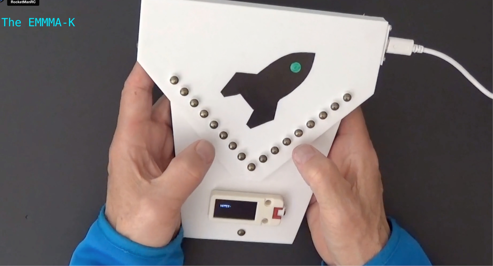

# EMMMA-K-V3

# Introduction
The EMMMA-K is a MIDI controller for electronic music that uses touch pins for note keys and user interface. A tilt sensor is used to generate MIDI commands for effects such as pitch bend and mod wheel.

The layout of the touch pins for note keys is modelled after the Kalimba (a.k.a. thumb piano) which is a modernized version of the MBira, an ancient african plucked instrument.

The history and evolution of the MBira and Kalimba is given on Wikipedia here:

https://en.wikipedia.org/wiki/Mbira

A great place to see and hear what the Kalimba is all about is April Yang's YouTube channel:

https://www.youtube.com/channel/UCV0A2VeScCoxiMhsA2kiIKw

In January, 2020 I became interested in making an electronic version of the Kalimba because I wanted a keyboard for electronic music that wasn't piano based and also could be hand-held. In March of that year I started working on a proof-of-concept prototype which I called the EMMMA-K. A write-up of that project is on my website here:

https://www.rocketmanrc.com/emmma-k.html

As crude as that first prototype was it actually performed pretty well and so when the COVID-19 lockdown started I decided to spend the time on a second version that had a better shape and layout and would be easier to build. There is also a write-up of that project here:

https://www.rocketmanrc.com/emmma-k-v2.html

This version supported additional music scales in addition to the Kalimba's C Major scale and a user interface was provided to change scale, key and octave.

Fast forward to October 2022... After working on a number of other unrelated projects I started researching what microcontrollers could be used to replace the TeensyLCs I was using before that were no longer available due to the dreaded world wide semiconductor shortage. The primary requirement was touch pin performance meaning good sensitivity and low latency. I discovered that the new ESP32-S2 and ESP32-S3 from Espressif are amazing for this purpose and so the EMMMA-K-V3 was born.

Video:

https://vimeo.com/831693210/e15a553c1c

# History

# Installation

### Source

# Notes

### IMPORTANT:

# User Interface

# Credits

