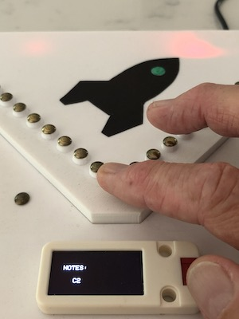
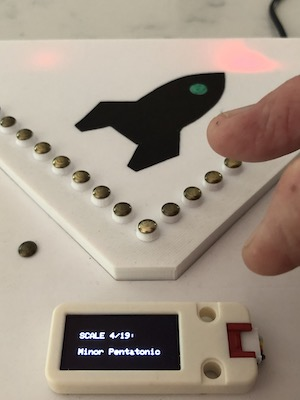
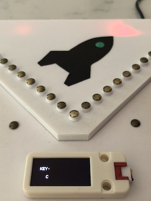
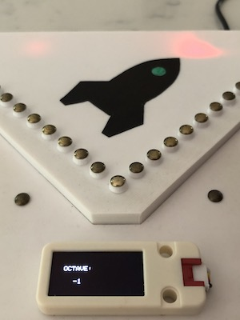
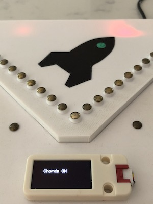
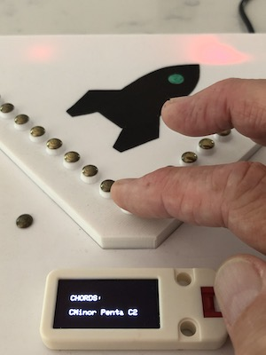

# EMMMA-K-V3

# Introduction
The EMMMA-K is a MIDI controller for electronic music that uses touch pins for note keys and user interface. A motion sensor is used to generate MIDI commands for effects such as pitch bend and mod wheel.

The layout of the touch pins for note keys is modeled after the Kalimba (a.k.a. thumb piano) which is a modernized version of the MBira, an ancient African plucked string instrument.

The history and evolution of the MBira and Kalimba is given on Wikipedia here:

[https://en.wikipedia.org/wiki/Mbira](https://en.wikipedia.org/wiki/Mbira)

A great place to see and hear what the Kalimba is all about is April Yang's YouTube channel:

[https://www.youtube.com/channel/UCV0A2VeScCoxiMhsA2kiIKw](https://www.youtube.com/channel/UCV0A2VeScCoxiMhsA2kiIKw)

In January, 2020 I became interested in making an electronic version of the Kalimba because I wanted a keyboard for electronic music that wasn't piano based and also could be hand-held. In March of that year I started working on a proof-of-concept prototype which I called the EMMMA-K. A write-up of that project is on my website here:

[https://www.rocketmanrc.com/emmma-k.html](https://www.rocketmanrc.com/emmma-k.html)

As crude as that first prototype was it actually performed pretty well and so when the COVID-19 lockdown started I decided to spend the time on a second version that had a better shape and layout and would be easier to build. There is also a write-up of that project here:

[https://www.rocketmanrc.com/emmma-k-v2.html](https://www.rocketmanrc.com/emmma-k-v2.html)

This version supported additional music scales in addition to the Kalimba's C Major scale and a user interface was provided to change scale, key and octave.

Fast forward to October 2022... After working on a number of other unrelated projects I started researching what microcontrollers could be used to replace the TeensyLCs I was using that were no longer available due to the dreaded world-wide semiconductor shortage. The primary requirement was touch pin performance meaning good sensitivity and low latency. I discovered that the new ESP32-S2 and ESP32-S3 from Espressif are excellent for this purpose and so the EMMMA-K-V3 was born.

**Videos:**

[https://vimeo.com/858654116](https://vimeo.com/858654116) Introduction

[https://vimeo.com/858421865](https://vimeo.com/858421865) Overview of Features

[https://vimeo.com/858731197](https://vimeo.com/858731197) Under the Hood

# Features

- Kalimba style keyboard with highly responsive and low latency touch pins.
- USB-C connector for USB MIDI and/or power.
- Wireless MIDI over BLE (Bluetooth Low Energy) or ESP-Now wireless to a USB MIDI hub or a Serial MIDI hub.
- ESP-Now wireless is ultra low latency (approximately 1.5 milliseconds).
- Dedicated option touch pin on the right side to enable tilt sensor for pitch bend and mod wheel (or other CC command).
- Multipurpose option touch pin on the left side for switching between major and minor relative scales, changing to chord mode and disabling the adjacent pin and dissonant note filters.
- User interface with OLED display and dedicated touch pins.
- Change Octave, Key and Scale on the fly or display notes as played.
- Settings mode to enable or disable filters, change MIDI channel, set master volume, set CC for mod wheel and choose wireless mode.

# System Design

This is a dual microcontroller master/slave system with a ESP32-S3 used for the master and a ESP32-S2 (or S3) for the slave. Each microcontroller has 14 touch pins and the ESP32-S3 is required for the master to support wireless over BLE (the ESP32-S2 does not). The microcontrollers exchange pin data via a UART connection with the master polling the slave for synchronous communications. The baud rate is set to 2000000 baud to eliminate any noticable latency.

The motion sensor is a breakout board with a MPU-6050 IMU and is connected to the master via I2C. The board provides three absolute angle measurments (roll, pitch and yaw) using the internal processing of the MPU-6050. The roll axis is used for the mod wheel and the pitch axis is used for pitch bend. The yaw axis is not currently used but could be used for some other purpose.

The use of the motion sensor to generate effects is enabled by touching and holding the option pin on the right hand side of the enclosure. This does not require a note to be played which has the advantage of allowing the EMMMA-K to be used for effects along with another MIDI controller. It also has the advantage that the effects will still be applied to a note with sustain even if the noteoff MIDI command has been issued. When the option pin is touched centre angles are calculated for roll and pitch and then the effects are calculated relative to that those. The logic can be changed so that absolute angles are used which works just as well and is a matter of personal preference. Generation of the effects uses a concept from model aviation called "expo". This means that the change in value of the effects are reduced around around the centre position giving a much smoother response overall.

A OLED display of resolution of 128 by 64 pixels is used for the user interface along with three dedicated touch pins. This display is on a seperate I2C port.

Power for the system is provided by a USB connection to a USB power pack or computer USB port.

To minimize point to point wiring PCBs have been designed to carry both the Master and Slave microcontroller boards.

The microcontroller boards are the ESP32-S3-DevKitC-1 and ESP32-S2-DevKitC-1 from Espressif and are available from all the major component suppliers. Alternatively there are versions of the S3 dev board available from AliExpress.

The code for the slave processor (inspite of what Github says in the repository list and pins) is located here:

[https://github.com/RocketManRC/EMMMA-K-V3-S](https://github.com/RocketManRC/EMMMA-K-V3-S)

The code for the wireless hub is located here:

[https://github.com/RocketManRC/EMMMA-K-V3-W](https://github.com/RocketManRC/EMMMA-K-V3-S)

# Building

I've designed a 3D-printed case that has evolved quite a bit since the very first prototype. I've tried to make it as ergonomic as possible in terms of size and balance and spacing between touch pins. The STL files for 3D printing are here [STL](STL-Files).

It is not necessary to have the 3D-printed case to try out this system as something made of foam board from the Dollar store works just fine.

I do recommend getting the printed circuit boards however as it makes the wiring for the touch pins a lot easier and reproducable although hand wiring will work as well. I had my boards made at JLCPCB. 

The KiCAD 6 design files and the gerbers are here [PCBs](KiCAD).

[TODO: add a wiring table for the hand wiring]

# Firmware

This is a PlatformIO project using the Arduino Framework. It might be possible to build the firmware using the Arduino IDE however this has not been tested as I don't use the Arduino IDE anymore.

Here is a short YouTube video that shows what is required to build and upload a PlatformIO project [https://www.youtube.com/watch?v=nlE2203Q3XI](https://www.youtube.com/watch?v=nlE2203Q3XI).

### Note: 

There is a quirk with the ESP32-S3 microcontroller that when a project uses USB MIDI the microcontroller must be put in bootloader mode before uploading new firmware otherwise there will be an error. This is not the case if USB MIDI is disabled. In platformio.ini you will see a comment telling how to enable and disable USB MIDI.

# User Guide

# User Interface Photos

### Main Menu:

      

### Settings:

     

# Reference Data

ESP32-S2-DevKitC-1: [https://docs.espressif.com/projects/esp-idf/en/latest/esp32s2/hw-reference/esp32s2/user-guide-s2-devkitc-1.html](https://docs.espressif.com/projects/esp-idf/en/latest/esp32s2/hw-reference/esp32s2/user-guide-s2-devkitc-1.html)

ESP32-S3-DevKitC-1: [https://docs.espressif.com/projects/esp-idf/en/latest/esp32s3/hw-reference/esp32s3/user-guide-devkitc-1.html](https://docs.espressif.com/projects/esp-idf/en/latest/esp32s3/hw-reference/esp32s3/user-guide-devkitc-1.html)

ESP32-S3-DevKitC-1 (N8R2 version) from AliExpress: [https://vi.aliexpress.com/item/1005004586894190.html](https://vi.aliexpress.com/item/1005004586894190.html)

USB-C Breakout Board from AliExpress: [https://vi.aliexpress.com/item/1005001337982060.html](https://vi.aliexpress.com/item/1005001337982060.html) Make sure to choose the female connector although having both may come in handy.

Schottky Diode: [https://www.digikey.ca/en/products/detail/panjit-international-inc/SS1040L-R1-00001/14660138](https://www.digikey.ca/en/products/detail/panjit-international-inc/SS1040L-R1-00001/14660138)

Upholstery Nails (for touch pins): [https://www.amazon.ca/Upholstery-Vintage-Furniture-Upholster-Decorative/dp/B08Q7XC9Y1](https://www.amazon.ca/Upholstery-Vintage-Furniture-Upholster-Decorative/dp/B08Q7XC9Y1)

ABS Glue: [https://a.co/d/97ip9cB](https://a.co/d/97ip9cB) I purchased this locally at the hardware store.

Nylon Standoffs and screws: [https://a.co/d/cQluBSF](https://a.co/d/cQluBSF)

M5 Stack OLED Display: [https://vi.aliexpress.com/item/1005003297480376.html](https://vi.aliexpress.com/item/1005003297480376.html) I bought mine from DigiKey for less but at the moment (September 14, 2023) they only have 2 left in stock

MPU-6050 Breakout Board: [https://a.co/d/5xTt3AK](https://a.co/d/5xTt3AK)

